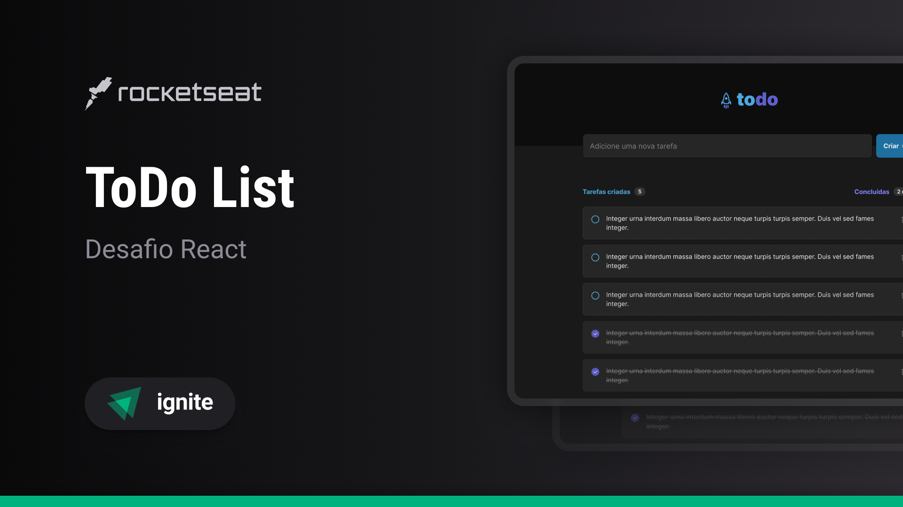

<h1 align="center">Projetos desenvolvidos 👽
</h1>

  <a href="#-tecnologias">Projetos</a>

 

## To Do List - WEB

<a href="https://github.com/marlisonmourao/desafios-rocket/tree/main/todo-list-web">

  

</a>
