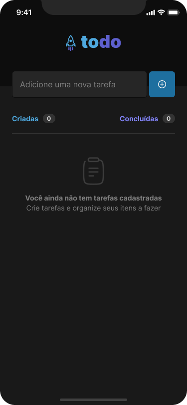
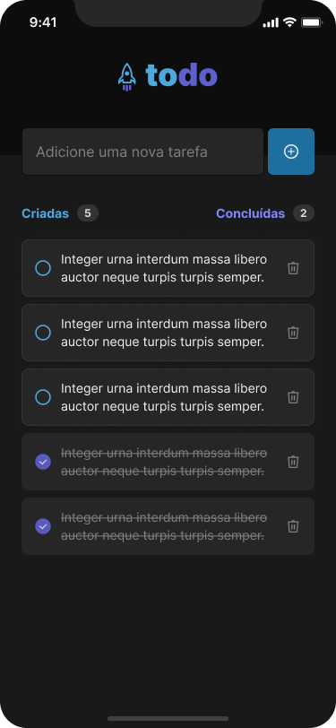

<h1 align="center">Todo List Mobile</h1>

<p align="center">
<a href="#-projeto">Projeto</a>&nbsp;&nbsp;&nbsp;|&nbsp;&nbsp;&nbsp;
<a href="#-clonando-o-projeto-para-sua-máquina">Clonar</a>&nbsp;&nbsp;&nbsp;

</p>

<br>

## 🚀 Telas

<div align="center" style="display: flex; gap: 20px; height: 400px; width: 100%; align-items: center; justify-content: center;">
  

</div>

## 🚀 Objetivos

Esta é uma aplicação web simples para ajudá-lo a organizar suas tarefas diárias. Com este aplicativo, você pode facilmente adicionar, remover e marcar tarefas como concluídas.

## 🚀 Figma

- [Layout do projeto (Clique aqui)](<https://www.figma.com/file/pte7JcjbyHluXgPOJ7XLdn/ToDo-List-%E2%80%A2-Desafio-React-Native-(Copy)?type=design&node-id=401-128&mode=design&t=Z6QCZLkSraO5Q5af-0>)

# 💻 Clonando o projeto para sua máquina

1. Abra o terminal de seu computador.
2. Acessar a pasta de seus projetos.
3. Estando dentro da pasta de seus projetos, execute os comandos abaixo para clonar o projeto online:

```bash
# Para fazer o download do projeto para seu computador
$ git clone https://github.com/marlisonmourao/desafios-rocket.git

# Entrar na pasta do projeto
$ cd desafios-rocket

# Entrar na pasta do app
$ cd todo-list-mobile

# Para baixar as dependências do projeto
$ npm install ou npm i

# Abra com o editor vscode
$ code .

# Rode o projeto
$ npx expo start
```

4. Pronto, agora basta testar e fazer as alterações que desejar.

<br>
<br>

<p align="center"></p>
<br>
<br>

---

<p align="center"> Made with 💜 by <a href="https://github.com/marlisonmourao"> Marlison Mourão </a></p>
